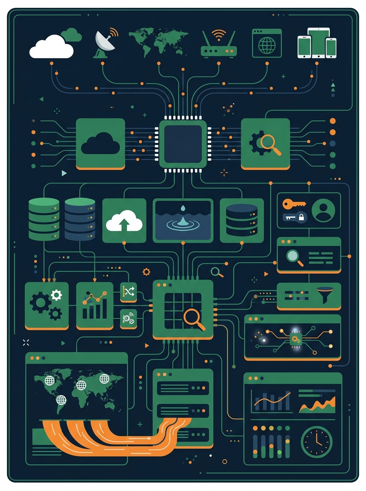
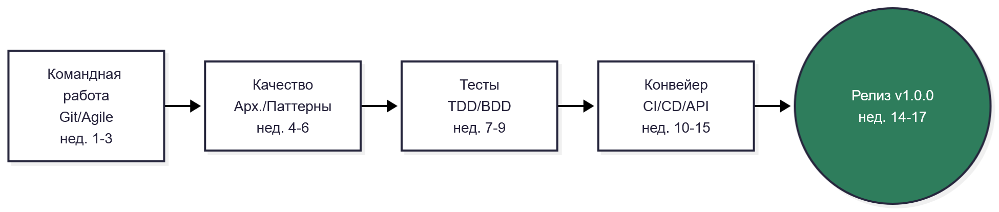
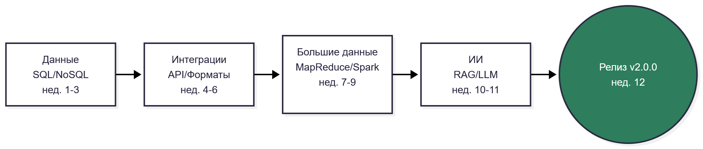

<!-- Картинки для слайдов генерируются промтами из файла «Промты_nanobanana_СТРПО.md»
     и сохраняются в папку pic/ рядом с презентацией.
     Пока картинки не созданы — строки с ![bg ...] можно закомментировать. -->

<!-- _class: titleslide -->
<!-- _paginate: false -->

# Современные технологии разработки ПО

## От идеи до релиза · вводная лекция

**Кедрин В.С. · ИГУ**

---

<!-- _class: titleslide -->
<!-- _paginate: false -->

<!-- Я один заметил, что Gemini в последнее время работает хуже? Игнорирует инструкции, плохо понимает, что от него требуют? Вот и с просьбой не генерировать текст в этой картинке были проблемы -->
<!-- prompt: Modern flat vector illustration, vertical composition. The backend architecture of a video content viewing resource aggregator in a minimalist style, Color palette: dark navy blue #1a2a3a, green #2e7d5b, orange accents. Flat, clean, minimal. No ANY text, no letters. -ar 3:4. NO ANY TEXT. NO ANY TEXT Otherwise, I’ll switch to Chat GPT.  -->

# Константин Перфильев

## Кандидат в темы мини-проекта: агрегатор ресурсов просмотра видеоконтента
## Ожидание от курса: узнать информацию о продакшене, чтобы выделяться и быть актуальным на рынке труда
---

Ожидания от курса

1. Узнать технологии продакшена, а не вакуум университета
2. Получить опыт работы с популярными языками и технологиями 
3. Найти способы остаться актуальным на рынке труда

Опасения

1. Курс может содержать неактуальную для современного продакшена информацию и не дать новых знаний.
2. Обучение может быть построено на нелюбимом и медленном Python.
3. Курс не поможет пробиться через высокую конкуренцию среди «архитекторов» и развитие нейросетей.

<!-- ИИ: черновик текста, отредактировано вручную -->

<!-- архитектор выделено в кавычки потому, раз джуны мало кому нужны, теперь любой дурак с двумя курсами онлайн образования может считать себя самым лучшим архитектором ПО -->
---

## 🎯 План лекции

1. История-хук: **45 минут, стоившие $440 000 000**
2. Правила игры: формат и контрольные точки
3. **Проектная работа** — стержень курса
4. Путешествие: 9 модулей / 2 семестра / 2 релиза
5. Мини-старт: что сделать к лабораторной №1

---

<!-- _class: story -->

## 💸 История: Knight Capital, 2012

9:30 утра, Нью-Йоркская биржа.

Алгоритмы крупнейшего трейдера США внезапно
скупают всё подряд и продают дешевле.

Сотрудники смотрят на экраны и **не понимают, что происходит**.

> За **45 минут** — **−$440 000 000**
> (~$10 млн в минуту)

---

<!-- _class: q -->

## ❓ Как так вышло?

**Не взлом, не ИИ, не диверсия — ручной деплой**

- Ночью обновили ПО на 8 серверах из 8...
  а сработал старый «мёртвый» код 2003 года
- Один сервер, одна забытая строка скрипта

### Мораль

> **Катастрофы в ПО — это не кривые алгоритмы,
> это кривые процессы.**
> Этим процессам и учимся: CI/CD начнём со 2-го модуля

---

## ✋ А теперь вы

Поднимите руку, кто:

- писал программу больше **1000 строк**
- писал программу **вдвоём** с кем-то
- пользовался **Git** / GitHub
- видел ситуацию *«у меня работало — у него нет»*

### Писать код вы уже умеете.
**В команде, надолго и без стыда за legacy — научимся здесь**

---

## 🧭 Формат дисциплины

<!-- Как же хочется жить в прекрасном мире где все языки производительные и экономные как С++ и Rust, но без замудрённого синтаксиса и костылей в использовании -->

| | |
|:---|:---|
| **Осенний семестр** | 17 недель × (2 ч лекция + 2 ч лаб) → **зачёт** |
| **Весенний семестр** | 12 недель × (1 ч лекция + 2 ч практики) → **экзамен** |
| Всего | **104 ч аудиторных**: 46 лекций + 58 лабораторных |
| Стек | единый — **Python** |

> Лабораторных **больше**, чем лекций — курс про ремесло.
> Практика без метода закрепляет ошибки: на лекции — метод, на лабе — руки

---

## 📊 Контроль: путь к зачёту и экзамену

**Осенний семестр → зачёт:**

- **РК-1** нед. 3 → **РК-2** нед. 9 → **РК-3** нед. 13 (*демо!*) → **зачёт** нед. 17

**Весенний семестр → экзамен:**

- **РК-4** нед. 6 → **защита + экзамен** нед. 12

> Каждые 3–4 недели — публичная веха.
> Это называется «показать заказчику работающий инкремент» — привыкайте

---

## 😄 Анекдот из индустрии

> — У меня же работало!
>
> — *У тебя* работало. А у пользователей?
> — Ну... у меня работало **быстрее**.

«У меня работало» — самая дорогая фраза в профессии
(см. слайд про Knight Capital)

**От этой болезни есть прививка — инженерная дисциплина**

---

## 🏗 Проектная работа — стержень курса

**Команда 3–5 человек · один продукт · два семестра**

| Семестр | Что делаем | Релиз |
|:---|:---|:---|
| **осень** | веб-приложение + полный конвейер: Git → Agile → архитектура → тесты → CI/CD → деплой → API → безопасность | **v1.0.0** |
| **весна** | слой данных и SQL, внешние интеграции, аналитика, Big Data / LLM-компонента | **v2.0.0** |

> Версии по **SemVer**: 2.0.0 = «сломали совместимость».
> Тег, changelog, страница релиза — как у настоящих продуктов

---

## ✅ Что будет в репозитории к финалу

- осмысленные коммиты и **PR с code review** («фикс #12», а не «fix»)
- **CI-пайплайн**: тесты + линтер + сканер безопасности на каждый PR
- покрытие тестами бизнес-логики **≥ 60 %**
- **Docker**, README, ADR, OpenAPI-документация
- *[весна]* слой данных: миграции, оконные функции/CTE
- *[весна]* внешняя интеграция, устойчивая к сбоям
- *[весна]* аналитический ноутбук + компонента **MapReduce/Spark или LLM**

> Это то, что на собеседовании открывают на ноутбуке и показывают

---

## 🗺 Карта осеннего семестра: одна цепочка

- **М1** ЖЦ и командная разработка · **М2** Проектирование и качество
- **М3** Тестирование · **М4** CI/CD и DevOps · **М5** Интеграция и безопасность

---

## 🤝 Недели 1–3. М1: командная разработка

- Git: ветки, конфликты, rebase — **с первой лабораторной**
- Pull request и культура code review
- Scrum: backlog, user stories, planning poker → **РК-1**

> **2005:** у сообщества Linux отняли BitKeeper —
> и Линус Торвальдс написал Git **за 10 дней**.
> «Git» по-английски — «мерзавец»: «называю проекты в свою честь»

---

## 🎨 Недели 4–6. М2: архитектура и качество

- Слои, Clean Architecture; монолит vs микросервисы
- SOLID, паттерны GoF, рефакторинг «грязного» модуля
- Линтер ruff, статанализ, метрики, **техдолг**

**Toyota, 2010:** в коде двигателя насчитали **10 000+ глобальных
переменных** → отзыв миллионов машин.
Техдолг = кредит под проценты (метафора У. Каннингема, 1992)

---

<!-- _class: story -->

## ☕ Перерыв 5 минут

*После перерыва — три самых «денежных» темы:*
*тесты, конвейер, безопасность*

---

## 🧪 Недели 7–9. М3: тестирование

- pytest: unit-тесты, AAA, моки и стабы
- **TDD** (red → green → refactor) и **BDD** (Gherkin)
- Интеграционные тесты, покрытие, flaky → **РК-2**

**Therac-25 (1980-е):** гонка данных в аппарате лучевой терапии —
шесть тяжелейших аварий. Аппаратную защиту убрали: «ведь ПО проверено»

**Дейкстра:** «Тестирование показывает наличие ошибок,
но не их отсутствие» — 100 % покрытия ≠ правильность

---

## 🚢 Недели 10–13. М4: CI/CD и DevOps

- **GitHub Actions**: тесты + линтер + безопасность на каждый PR
- **Docker**: «у меня работало» перестаёт быть аргументом
- Автодеплой, стратегии blue-green/canary
- Мониторинг: логи, метрики, health-check → **РК-3, демо**

> **Flickr, 2009:** доклад «10 деплоев в день» → DevOpsDays → **DevOps**.
> **Netflix Chaos Monkey** специально роняет продакшн —
> чтобы отказоустойчивость строилась по умолчанию

---

## 🛡 Недели 14–17. М5: API и безопасность

- **REST + OpenAPI**: контракт-first, мок-сервер, генерация доков
- **OWASP Top 10**: инъекции, XSS, CSRF, секреты; сканер в CI
- Семвер, changelog, README, ADR → **релиз v1.0.0**

**xkcd #327:** сына зовут `Robert'); DROP TABLE Students;--` —
SQL-инъекции в топе уязвимостей уже 20+ лет.
**Equifax, 2017:** не обновили библиотеку → утекли данные 147 млн человек

---

## 🏁 Зачёт (осенний семестр): из чего складывается

| Компонент | Вес |
|:---|--:|
| РК-1 + РК-2 + РК-3 | **45 %** |
| Проектная работа, этап 1 (релиз v1.0.0) | **40 %** |
| Активность на лабораторных | **15 %** |

Защита = **демо работающего приложения** + конвейер + вопросы.
Взаимная оценка команд — смотрим проекты друг друга

> «Отсидеться» не получится — как и в реальной команде

---

## 🗺 Карта весеннего семестра: продолжение цепочки

- **М6** Данные в приложении · **М7** Внешние данные и интеграция (РК-4)
- **М8** Инженерия больших данных · **М9** ИИ и итоговый релиз

---

## 💾 Недели 1–3. М6: данные в приложении

- Выбор СУБД: ACID, индексы, NoSQL-семейство
- **Оконные функции, CTE, поворот строк** — практика на PostgreSQL (Docker / песочница)
- Миграции как код, ORM vs SQL, **проблема N+1**

> **N+1:** `for order in orders: order.customer.name` —
> красиво в коде = **101 запрос** к БД на 100 заказов.
> На лабе: «было 8 секунд → стало 40 мс», замер обязателен

---

## 🔌 Недели 4–6. М7: внешние данные и интеграции

- HTTP-клиент: таймауты, **ретраи с экспоненциальной задержкой**
- Идемпотентность, rate-limit, кеш, вебхуки
- JSON/XML/CSV + валидация схем; этика сбора (robots.txt)
- **Pandas**: выгрузка → очистка → выводы → **РК-4**

> **Джен** перезапустит программу. **Инженер** настроит ретраи 1с → 2с → 4с.
> **Сеньор** спросит: *идемпотентен ли запрос?* (оплата трижды = платим трижды)

---

## ⚡ Недели 7–9. М8: инженерия больших данных

- **MapReduce** на чистом Python — понять модель и её границы
- **PySpark** (локально): DataFrame API, Spark SQL, сравнение с Pandas
- События в приложении: шина, фоновые обработчики, идемпотентность

> **Google, 2004:** map → shuffle → reduce = индексация всего интернета.
> **Hadoop** — жёлтый слоник сына Дага Каттинга.
> **Spark:** 100 ТБ за 23 мин (рекорд 2014). **Kafka** — в честь Франца Кафки

---

## 🤖 Недели 10–12. М9: ИИ и итоговый релиз

- **ИИ-ассистенты в команде**: промптинг, галлюцинации, лицензии,
  политика команды → в CONTRIBUTING
- **LLM-компонента продукта**: RAG или text-to-SQL над своей БД —
  с тестами эталонных вопросов, метриками, деградацией
- Релиз **v2.0.0** → итоговая защита + **экзамен**

**Нью-Йорк, 2023:** юрист подал прецеденты из ChatGPT —
6 дел с цитатами. **Ни одного не существовало.** Штраф $5 000

---

## 🔗 Две дисциплины — одна технология

| Тема | У нас (СТРПО) | В «Больших данных» |
|:---|:---|:---|
| СУБД, SQL, окна | **внедрение в приложение** | классификация, DWH |
| API, JSON, парсинг | устойчивый клиент продукта | сбор датасетов |
| Pandas | метрики и отчёты продукта | подготовка данных |
| Spark, потоки | прикладная обработка, события | оптимизация, стриминг |
| LLM, RAG | ИИ в коде и продукте | анализ корпусов текстов |

> Одни технологии — **с двух сторон**.
> Датасет «БД» официально можно переиспользовать в LLM-компоненте

---

## 📊 Оценивание: два билета

| **Зачёт (осень)** | | **Экзамен (весна)** | |
|:---|--:|:---|--:|
| РК-1…РК-3 | 45 % | РК-4 | 20 % |
| Проектная работа (v1.0.0) | 40 % | **Проектная работа (v2.0.0)** | **50 %** |
| Активность | 15 % | Итоговый тест | 30 % |

> **Половина оценки экзамена — то, что вы делали руками весь семестр.**
> Проектную работу нельзя выучить накануне — её можно только сделать

---

## 🧰 Стек курса

| Осень | Весна |
|:---|:---|
| Python 3.11+, pytest, ruff, mypy | PostgreSQL / SQLite (+NoSQL по проекту) |
| Git, GitHub: Projects, Actions, PR | PostgreSQL (Docker), Alembic |
| Docker, docker-compose | pandas, PySpark (локальный режим) |
| PaaS-деплой (Render/Railway) | httpx, LLM API / Ollama, chromadb |
| OpenAPI, Postman/Prism | Redis / очередь событий |

> Каждый инструмент появляется **ровно тогда**,
> когда для него есть задача — и запоминается сам

---

## 📚 Литература: с чего начать

1. **Мартин Р.** «Чистый код» — *как писать*
2. **Фаулер М.** «Рефакторинг» — *как переписывать*
3. **Ким и др.** «The DevOps Handbook» — *как доставлять до пользователя*

Дальше — по модулям: Бек (TDD), Scrum Guide, OWASP Top 10;
весной — Дейт, документация pandas / PySpark

---

<!-- _class: story -->

## 🤝 Три честных обещания

1. **Будет трудно**: контейнеры падают, тесты краснеют, код мержится криво
2. **Всё преодолимо**: система РК рассчитана на ровный темп,
  а не на героизм перед зачётом
3. **Навык останется с вами**: проектная работа уходит в портфолио

> *«Слабый ноутбук»* → всё в Docker/Colab. *«Мы поссорились»* →
> конфликт в команде — тоже учебный материал. *«Всё сгенерирует ИИ»* →
> на защите объясняете каждую строку — сгенерирована она или нет

---

## 🚀 Мини-старт: к лабораторной №1 (уже на этой неделе)

1. Установить **Python 3.11+**, **Git**, **VS Code**
   *(инструкция — в материалах недели 1)*
2. Создать аккаунт **GitHub**
3. Собрать **команду 3–5 человек** и обсудить **идею продукта**

Работающая простая система лучше красивой недоделанной.
Идея должна быть вам не безразлична — тогда получится живой кейс

---

<!-- _class: story -->

## 🏔 Два семестра. Один продукт. Два релиза.

Инженерная дисциплина — то, что отличает

«работает у меня»

от

«работает у всех, всегда, и это можно доказать»

### Вопросы? 🙋
